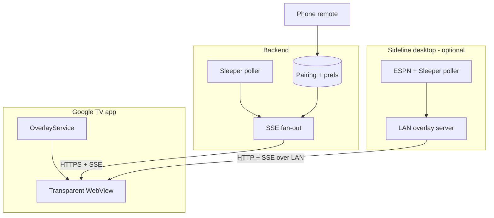

# Productizing the Sideline TV overlay

Status: proposal. Nothing here is committed to. Written after the Stage 1–3 personal rig
worked (LAN overlay server + Google TV transparent WebView).

The purpose of this document is to be honest about what productizing costs, what the real
wedge is, and where the plan should be killed rather than pushed.

---

## 1. Where we actually stand

The personal rig proves the hard technical claim: a third-party app *can* draw a live HUD
over DRM-protected video on Google TV. That is the only consumer TV OS where this is true.
Everything else (tvOS, Roku, Fire TV, webOS, Tizen) has no third-party overlay API, and
Cast/AirPlay/Miracast are input takeovers with no alpha channel.

But the rig is not a product. It requires:

- a PC awake on the same LAN,
- typing an IP, port, and 16-hex-char token on a TV remote,
- sideloading an APK over `adb`,
- manually granting `SYSTEM_ALERT_WINDOW` in Settings.

Each of those is a step where a real user quits.

### The competitor

[ScoreProTV](https://scoreprotv.com/) ships this today on Google TV / Android TV:
Play Store distribution, Sleeper and Yahoo Fantasy, cloud sync, an iOS companion remote,
big-play alerts, betting props, and a free tier. Paid tiers are $0.99/mo (Sports) and
$3.99/mo (Premium). They market themselves as "first and only."

Assume they are competent and funded well enough to keep shipping. Do not plan around them
disappearing.

### The wedge, stated precisely

ScoreProTV is a **score ticker with fantasy attached**. It shows the teams and matchups you
follow, cycling through them.

Sideline is a **single-matchup companion with full lineup depth** — your starters and your
opponent's starters, side by side, live. That is a different product for a different user:
someone whose Sunday is one fantasy matchup, not five leagues and eight teams.

Two concrete differentiators:

1. **Opponent starters.** Sideline already renders both lineups (`myStarters` /
   `oppStarters` in `OverlayHudState`). A ticker cannot show this.
2. **ESPN league support.** ScoreProTV supports Sleeper and Yahoo. ESPN is the largest
   fantasy platform by users and neither of us has a sanctioned path to it.

Point 2 is the wedge *and* the trap. See section 2.

---

## 2. The ESPN problem — decide this before anything else

Sideline's ESPN support works by opening ESPN's own login in an Electron window and reading
`espn_s2` and `SWID` cookies out of the `persist:espn` session partition on the user's own
machine. The README is explicit that this is unofficial and for personal use.

That design is defensible precisely *because* it is local. The cookies never leave the
user's PC, and the user is accessing their own account with their own credentials.

**A cloud backend breaks that defence.** To poll ESPN without the PC, a server needs those
cookies. That means:

- **Credential custody.** You are storing long-lived session cookies for a third-party
  account, per user, server-side. That is a breach-severity liability an order of magnitude
  above anything Sideline currently holds.
- **Terms of service.** Automated server-side access to ESPN's private fantasy endpoints
  using scraped session cookies is a materially worse posture than a user's own desktop app
  making the same call. Expect it to be shut off, and expect no warning.
- **Fragility.** Those cookies expire in weeks. A cloud product would be sending re-login
  nags constantly, and the re-login requires a browser the TV does not have.

### Recommended resolution: hybrid, permanently

Do not move ESPN to the cloud. Ever.

| Provider | Path | Requires PC awake? |
| --- | --- | --- |
| Sleeper | Cloud-native | No |
| ESPN | PC-tethered (today's LAN architecture) | Yes |

Sleeper's API is read-only, public, and keyed by **username with no auth at all**. A backend
can poll it with zero credential custody and zero OAuth. This is unusually cheap.

So: Sleeper users get the real product. ESPN users get "Sideline works, but leave your PC
on" — which is exactly what they have now, and is an honest, shippable answer. The ESPN
wedge stays a *desktop* wedge, not a cloud one.

If that split is unacceptable, then productization means building Yahoo OAuth (as
ScoreProTV did) and competing head-on with no wedge. That is a much worse plan and should be
recognised as such.

---

## 3. Target architecture

The TV app stays a dumb transparent shell in both modes. It points at either a cloud URL or
a LAN URL. That is the single most important architectural property to preserve — it is why
the TV app has no fantasy logic, no provider code, and no duplicated layout, and it is why
the HUD only has to be designed once.

---

## 4. Phased plan

### Phase 0 — Make the personal rig not embarrassing (1–2 weeks)

Prerequisite for everything. No backend yet.

- **mDNS pairing.** Advertise `_sideline._tcp` from the Electron main process; discover with
  `NsdManager` on the TV. Kills manual IP entry.
- **Short pairing code.** Replace the 16-hex token in the UI with a 6-digit code that maps
  to the token server-side-of-the-LAN (i.e. in the Electron process). Typing `418302` on a
  remote is tolerable; typing `a3f9c2d10b8e4f77` is not.
- **Auto-reconnect on the TV.** Restart `OverlayService` on boot and on network regain.
  Currently a Wi-Fi blip needs a manual restart.
- **Overlay presets from the phone.** Position/size/opacity are on the TV today, which means
  fiddling with a remote mid-game.

Gate: can a friend set this up from the couch in under 3 minutes, with only a phone?

### Phase 1 — Cloud-native Sleeper (4–6 weeks)

- **Pairing service.** TV shows a code; phone or web claims it; TV receives a device token.
  No user accounts yet — a device token *is* the identity.
- **Sleeper poller.** One worker polling per tracked league, fanning out over SSE. Respect
  Sleeper's 1000 req/min guidance; cache the player map daily exactly as the desktop does.
- **Reuse the HUD verbatim.** Serve the same `?tv=1` page from the backend. Same React, same
  `OverlayHudState` shape. If the payload contract is preserved, the TV app needs no change
  at all between LAN and cloud mode.
- **Stack.** Cloudflare Workers + Durable Objects, or a single small Fly.io machine. SSE
  over HTTPS. Postgres or KV for pairings and prefs. Deliberately boring.

Gate: HUD runs a full Sunday with the PC powered off, no manual intervention.

### Phase 2 — Distribution (2–4 weeks, mostly waiting)

The main unknown is Play Store review of an app requesting `SYSTEM_ALERT_WINDOW`.

- **Primary path:** publish with `SYSTEM_ALERT_WINDOW`, justified as the app's core declared
  purpose. ScoreProTV is on Play with an overlay, so this is achievable, but their exact
  permission posture is unverified and should not be assumed.
- **Fallback path:** Android 14's picture-in-picture **`ticker`** category
  (`com.google.android.tv.pip.category`), which Google documents explicitly for "live sports
  scores." It is approval-gated, requires user action to enter, forbids media playback and
  interactive controls, and gives a *bordered PiP window* rather than a transparent overlay.
  Worse product, sanctioned path. Build it only if the primary path is refused.
- **Do not plan for Fire TV.** All future Fire TV sticks run Vega OS — not Android, no
  sideloading, Appstore only. The Android-based installed base only shrinks from here.
- **iOS/Android remote app** is optional in Phase 2, mandatory if the phone becomes the
  primary settings surface.

Gate: installable from the Play Store on a stock Google TV with no `adb`.

### Phase 3 — Monetization (after Phase 2 holds for one season)

Price against the incumbent, don't undercut into irrelevance.

- **Free:** one league, HUD only.
- **Paid, ~$2/mo or ~$15/yr:** unlimited leagues, ESPN via desktop tether, big-play alerts,
  multiple saved layouts.

Charging before a full season of proven Sunday reliability will generate refunds and
one-star reviews. The failure mode of this product is highly visible: it sits on top of the
game.

---

## 5. Risk register

| Risk | Severity | Mitigation |
| --- | --- | --- |
| Overlay blacks out DRM video on some devices | **Fatal per-device** | Ship the test-overlay spike *in the app* as a first-run check; maintain a device allowlist/denylist from real reports |
| A streaming app adopts `HIDE_OVERLAY_WINDOWS` | High | No mitigation. Android 12+ lets any app opt out. Detect and tell the user honestly |
| Play Store rejects `SYSTEM_ALERT_WINDOW` | High | PiP `ticker` fallback (worse UX, sanctioned) |
| ESPN blocks unofficial access | Medium | Already isolated to desktop; degrade to Sleeper-only, don't take the platform down with it |
| Sleeper changes or rate-limits its API | Medium | It's the whole cloud path. Cache aggressively, stay well under published guidance |
| ScoreProTV ships full opponent lineups | Medium | Wedge evaporates. This is a genuine kill criterion |
| Google TV market share is small | Structural | Accept it. It is the only platform where the product is possible |

---

## 6. Cost model (first year, solo)

| Item | Cost |
| --- | --- |
| Play Store developer account | $25 one-time |
| Apple Developer (only if iOS remote) | $99/yr |
| Backend (Workers or one small VM) | $5–25/mo |
| Domain + TLS | ~$15/yr |
| **Total before revenue** | **well under $500/yr** |

This is the strongest argument for trying: the downside is a few hundred dollars and some
weekends. Compare to the HDMI hardware box the research ruled out — $35–50K/yr in HDMI and
HDCP licensing before a single unit ships, against a $1M liquidated-damages floor.

---

## 7. Decision gates

Kill or park the effort if any of these are true:

1. The DRM spike fails on mainstream Google TV hardware (Google TV Streamer, onn., Sony/TCL/Hisense).
2. Play Store refuses the overlay permission *and* the PiP `ticker` window is too degraded to be worth shipping.
3. Phase 0 cannot get setup under 3 minutes — if the personal rig is still fiddly, the product will be worse.
4. ScoreProTV ships full opponent-lineup depth before Phase 1 lands.
5. It stops being fun to work on. This is a hobby-scale product with hobby-scale upside; the
   only real budget being spent is attention.

---

## 8. What to do next

Finish testing the personal rig. Then do **Phase 0 only**, and use it for a real Sunday
before writing a single line of backend code. Most of what Phase 1 should be will only
become clear after four hours of actually watching football with the HUD on.
